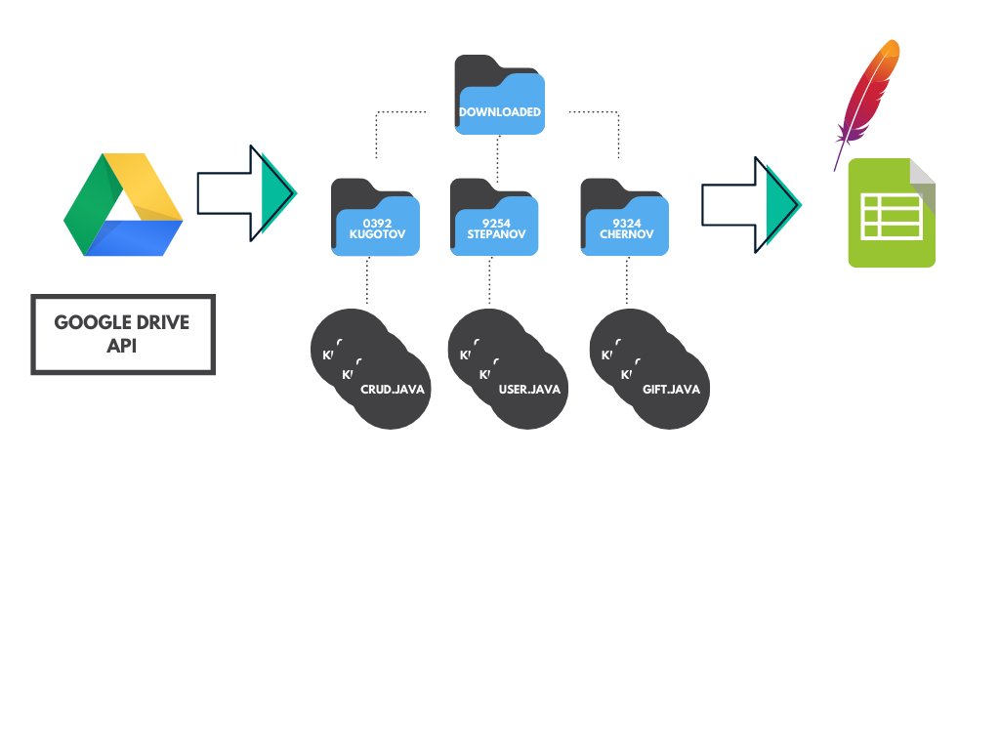

# Тестирование

Задача: студенты заливают файлы на Google Drive, я скачиваю их 
оттуда и тестирую. Рез-ты загоняю в excel таблицу (Apache POI).

# Сложности

*1*: С чем мы работаем: `Class` (Reflection) или `io.File`? 

*2*: Как динамически менять `package` каждого класса? 
- Если мы работаем с файлом, у файла нет свойства Package.
- Если с классом, он не будет компилироваться, тк package не соотв нужному 

# Google

С гуглом проблем нет, в `src.main.resources` закидываем `json` файл,
содержащий client_id, project_id и тд (см. [документацию Google](https://developers.google.com/drive/api/v3/quickstart/java)).

Далее меняем `folderID` внутри `google.Download` и скармливаем
`downloadFolder(Drive drive)` нужный драйв. Всё готово :)

# Apache POI

Этим инструментом нужно строить Excel таблицу по строкам, не столбцам!
То есть после тестирования каждого студента, добавляется строчка с его именем
и статусом сдачи. Все классы в пакете `xlsx`.